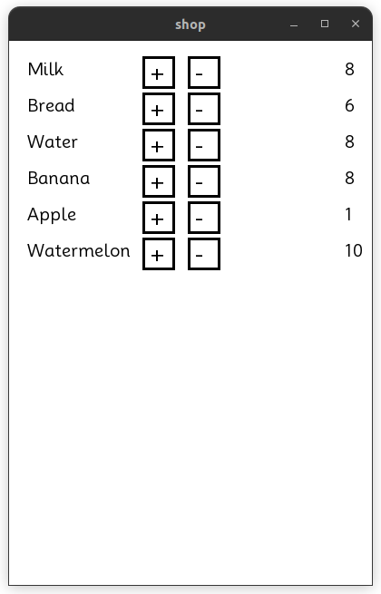

# MVP 
 1. Check name ( relies user text input, create sql-request into USERS name, 
if name found ask password , else add name to table USERS and ask to create password)
 2. Show list with goods ( sql-request , show list from table GOODS (name , count))
 3. Realies facilities to change count (increment / decremnt count)
 
 

