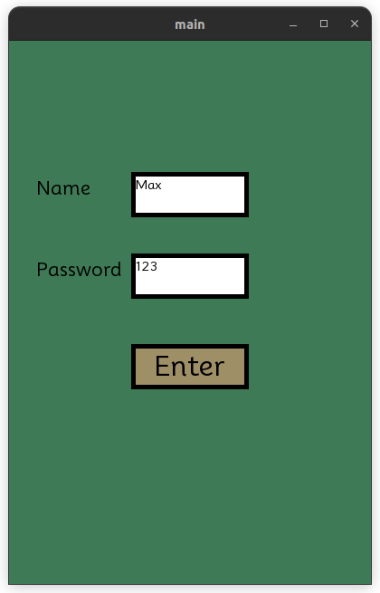
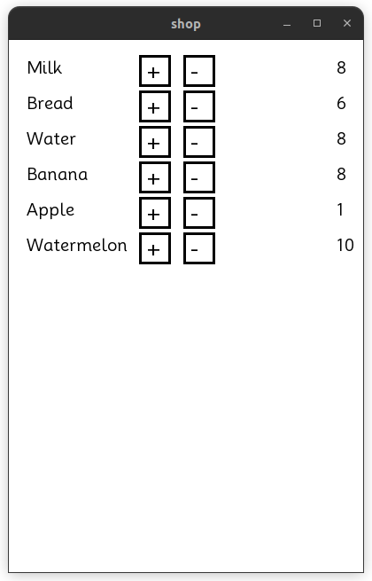

# <p align = "center">**ATB** </p>


### Info

#### **ATB** is a [my](https://github.com/rutlexd) pet-project. </br> In which i researched *SQLite* also with *GUI*, i relise it with SFML.
--- 
### Func part

#### At first you need login or registry, after succeffuly enter you can take or put some goods


</br> 

### Setup (Ubuntu)

``` sh
$ sudo apt-get install libsfml-dev
$ git clone https://github.com/rutlexd/ATB.git
```

### Compiling 
``` sh
$ g++ -c main.cpp
$ g++ main.o -o sfml-app -lsqlite3 -lsfml-graphics -lsfml-window -lsfml-system
```

